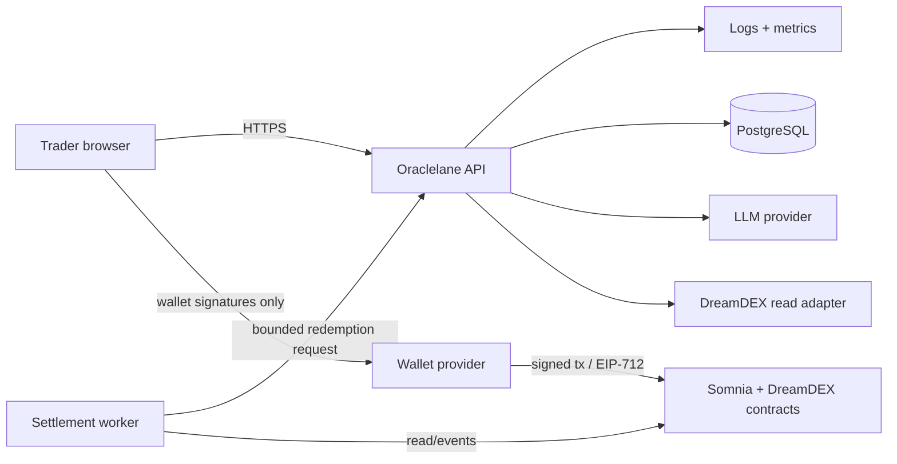

# 1. System context

## Mission

Oraclelane helps a first-time trader move from “what is this market?” to a bounded, user-signed position and later a safely settled position. It combines live DreamDEX market data, evidence-backed AI explanation, deterministic risk controls, and non-custodial execution.

## Actors and trust boundaries

The browser and wallet are the only components allowed to initiate a user trade. The API never receives a private key. The LLM is untrusted advisory input. Chain state and DreamDEX contract events are authoritative for money and settlement state.

## External systems

| System | Role | Trust level | Failure posture |
|---|---|---|---|
| Somnia RPC | Reads, simulations, transaction submission via wallet | authoritative transport | retry with bounded backoff; show pending |
| DreamDEX Event Contracts | market, pool, settlement state | authoritative financial state | never infer finality from API cache |
| DreamDEX markets SDK | typed read/write encoding helpers | pinned dependency | adapter isolates version changes |
| LLM provider | thesis generation | untrusted, non-financial | timeout; fall back to no thesis |
| PostgreSQL | projection/audit store | derived | rebuild from chain and source APIs |
| Wallet provider | user consent/signature | user-controlled | explicit rejection/cancel states |

## Architectural principles

1. **Chain truth wins.** Cached or model-derived values cannot authorize a settlement or trade.
2. **Advisory AI, deterministic action.** AI may recommend `UP`, `DOWN`, or `NO_TRADE`; only the safety gate can produce an executable quote.
3. **Non-custodial by construction.** The server can prepare calldata but cannot sign for the user.
4. **Progressive proof.** Every vertical slice has a mock contract test and a testnet evidence path.
5. **Degraded but honest.** If evidence, RPC, or reactivity is unavailable, the UI says so and preserves manual recovery.
