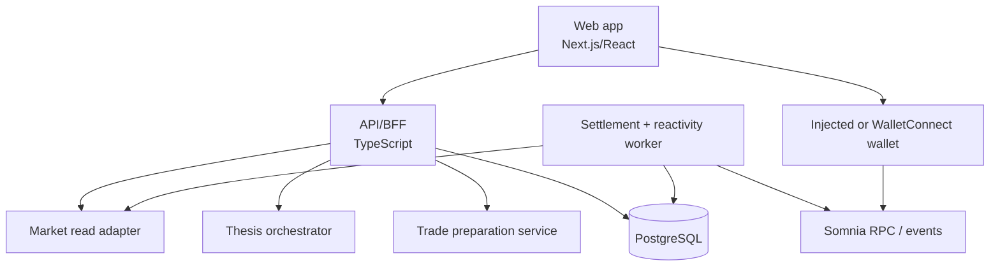

# 2. Container architecture

## Deployable containers

### Web app

Renders market radar, case file, thesis panel, safety gate, trade drawer, position lifecycle, and settlement status. It consumes only generated API types and wallet actions. It must never calculate payout from untrusted display data.

### API/BFF

Task-oriented REST API. It authenticates optional wallet sessions, rate-limits expensive thesis calls, validates every request/response, and records correlation IDs. It has no signing key.

### Market read adapter

Normalizes DreamDEX SDK/RPC/indexer data into Oraclelane domain snapshots. It handles decimal conversion, market lifecycle, outcome-token resolution, and stale-data flags.

### Thesis orchestrator

Builds a bounded evidence packet, calls the LLM with a structured-output schema, validates citations and expiry, and returns a thesis artifact. It cannot call trade or settlement commands.

### Trade preparation service

Calculates the preview from current market data, validates input limits, encodes a user wallet transaction, and returns a short-lived quote. The browser submits the transaction.

### Settlement/reactivity worker

Consumes finalized settlement events, derives the winning outcome from the payout vector, prepares a redemption authorization, and submits only the bounded redeem operation. If automation fails, it exposes a manual redemption path.

### PostgreSQL

Stores projections, evidence packets, quote intents, transaction observations, and audit records. It is not a source of funds or chain truth.
