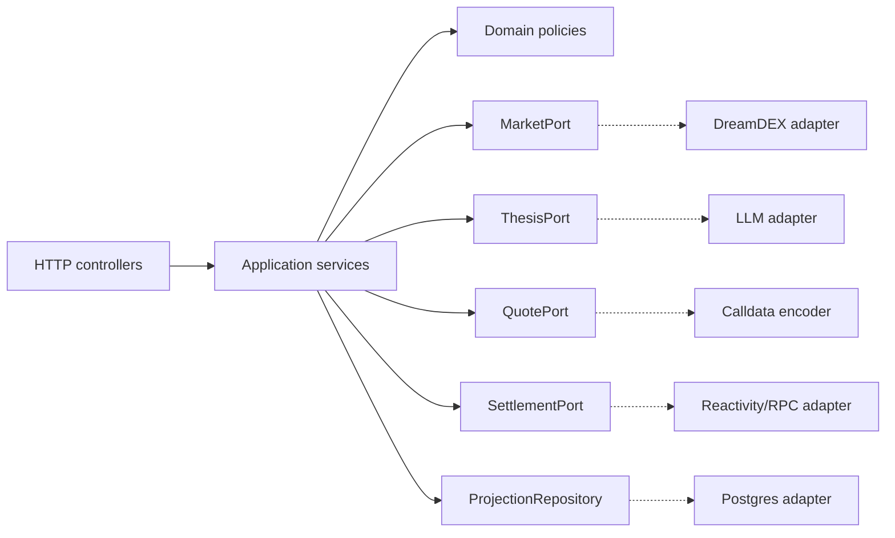

# 3. Component architecture

Oraclelane uses a hexagonal boundary: domain/application code depends on ports; SDKs, RPC, LLMs, wallets, and storage are adapters.

## Ports

| Port | Required operations | Invariant |
|---|---|---|
| `MarketPort` | list, get snapshot, get settlement status | IDs remain opaque strings |
| `ThesisPort` | generate from evidence packet | output is advisory and expiring |
| `QuotePort` | preview, encode user tx | quote is bound to snapshot/version/expiry |
| `SettlementPort` | observe finalization, prepare redeem | no redemption before finality |
| `WalletSessionPort` | nonce/session verification | no private key or signing server-side |
| `ProjectionRepository` | upsert/read projections, audit append | append-only audit events |

## Dependency rules

- Domain packages import no framework, RPC, SDK, or database package.
- Controllers map HTTP DTOs to application commands; they do not contain protocol math.
- Adapters are pinned and contract-tested with fixtures from testnet.
- Any new external dependency needs an ADR and a failure/fallback note.
