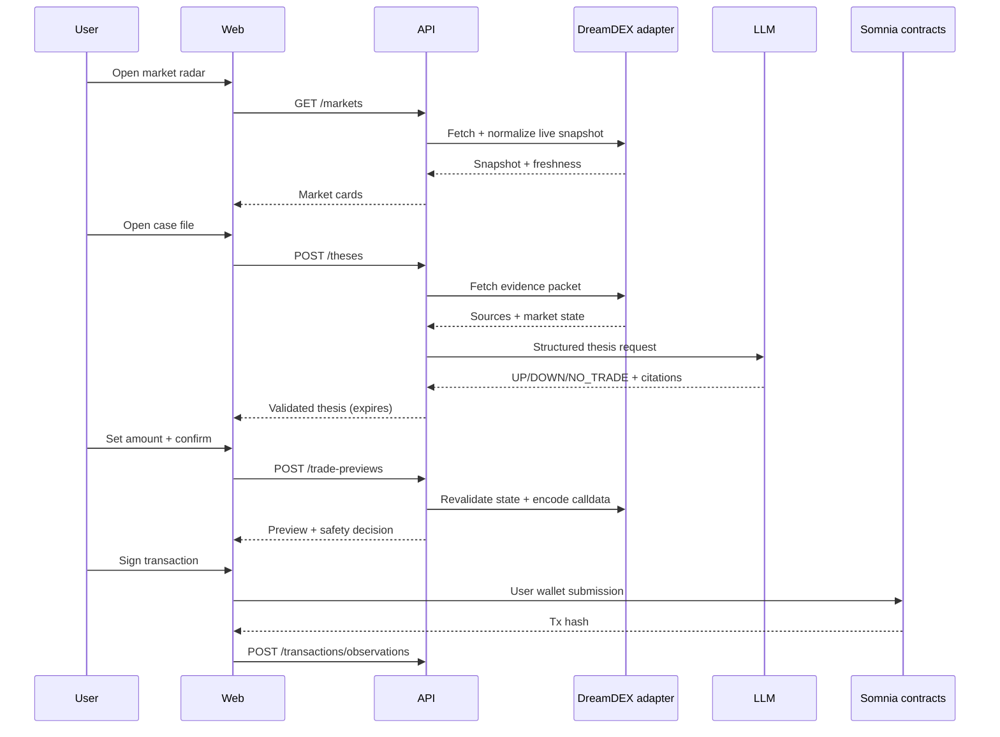
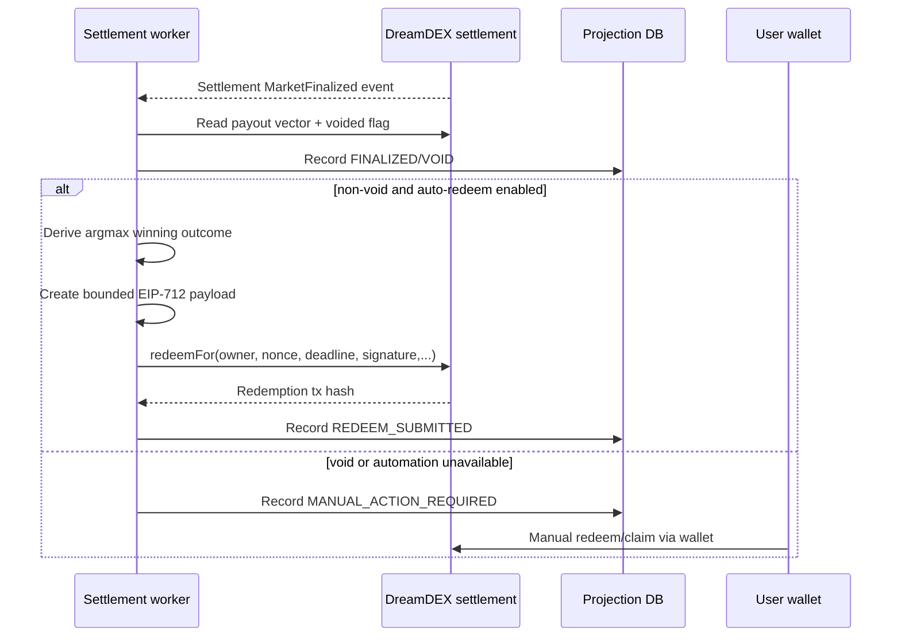

# 4. Runtime data flows

## A. Discover → thesis → trade

## B. Finalize → redeem

Every transition is idempotent on `(chainId, marketKey, eventNonce)` or `(owner, nonce)`. A worker restart must not duplicate a redemption.
