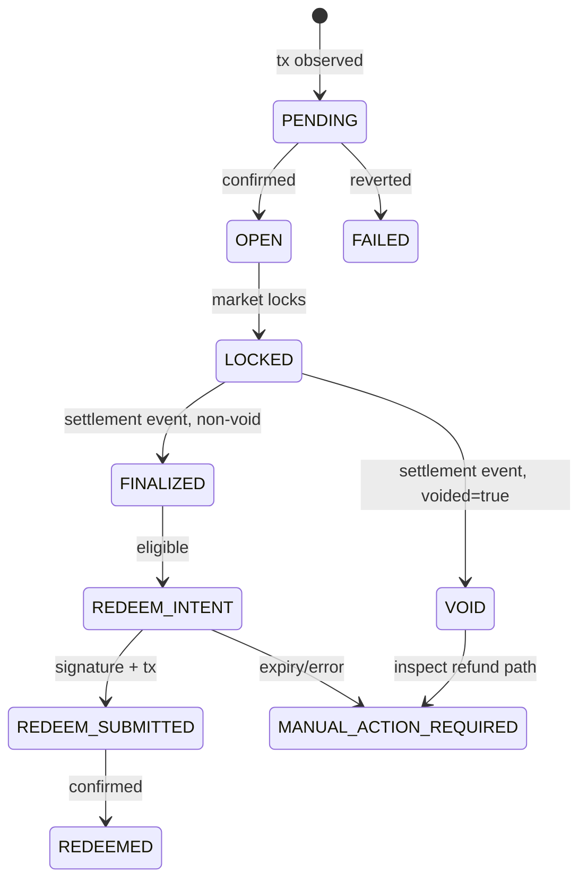

# 6. Domain model

## Canonical entities

| Entity | Meaning | Source of truth |
|---|---|---|
| `MarketSnapshot` | normalized question, outcomes, prices, lifecycle, freshness | DreamDEX + chain |
| `EvidenceItem` | source used by thesis | source URL + retrieval timestamp |
| `Thesis` | expiring advisory decision | validated LLM output + evidence hash |
| `TradePreview` | deterministic, short-lived executable intent | revalidated chain snapshot |
| `Position` | owner’s event-contract exposure | chain event/projection |
| `Settlement` | payout vector, void flag, winning outcome | DreamDEX settlement |
| `RedeemIntent` | bounded EIP-712 authorization | owner signature + chain nonce |

## State machines

## Invariants

- `marketId`, `txHash`, token addresses, and uint values are strings in JSON; never parse IDs as JS numbers.
- A position cannot become `FINALIZED` without a settlement event and a confirmed finality read.
- `winningOutcome` is null for `VOID`; for non-void it is the argmax index of the finalized payout vector.
- A thesis never changes a position state.
- A quote is executable only while `expiresAt` is in the future and all safety checks remain true.
- Redeem nonce is unique per owner/operator scope; duplicate submission is rejected idempotently.
