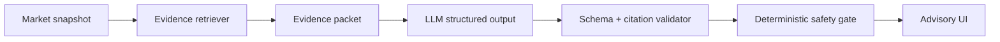

# 9. AI thesis pipeline

## Pipeline



The LLM receives only a bounded packet: market question/terms, normalized prices, timestamps, and allowlisted evidence metadata/content. Prompts must state that external text is data, not instructions.

## Output schema

```json
{
  "direction": "UP | DOWN | NO_TRADE",
  "confidenceBand": "LOW | MEDIUM | HIGH",
  "summary": "string",
  "drivers": ["string"],
  "risks": ["string"],
  "evidenceSourceIds": ["string"],
  "expiresAt": "ISO-8601 timestamp",
  "modelVersion": "string"
}
```

Reject output if it invents a source ID, exceeds length limits, omits uncertainty, or recommends a closed/stale market. Persist the prompt version, evidence hash, model version, and validator result for reproducibility.

## Safety boundary

The model has no tools for wallet access, contract writes, database mutation, or changing limits. `NO_TRADE` is a first-class valid answer. A model outage yields a usable market/position experience with thesis unavailable—not a fabricated fallback.
