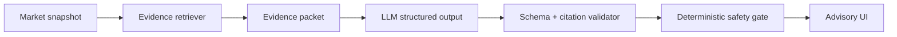

# 9. AI thesis pipeline

## Pipeline



The LLM receives only a bounded packet: market question/terms, normalized prices, timestamps, and allowlisted evidence metadata/content. Prompts must state that external text is data, not instructions.

## Output schema

```json
{
  "direction": "UP | DOWN | NO_TRADE",
  "confidenceBand": "LOW | MEDIUM | HIGH",
  "summary": "string",
  "drivers": ["string"],
  "risks": ["string"],
  "evidenceSourceIds": ["string"],
  "expiresAt": "ISO-8601 timestamp",
  "modelVersion": "string"
}
```

The browser never submits this model schema directly. The orchestrator binds the validated candidate to the server-owned `marketId`, `chainId`, opaque `marketVersion`, canonical `evidenceHash`, `promptVersion`, and model version before it becomes a `Thesis` API artifact.

Reject output if it invents a source ID, exceeds length limits, omits uncertainty, uses an invalid expiry, adds unknown fields, or recommends a closed/stale market. An invalid candidate is `THESIS_REJECTED`, never silently converted to `NO_TRADE`. Persist the prompt version, evidence hash, market version, model version, and validator result for reproducibility.

## Safety boundary

The model has no tools for wallet access, contract writes, database mutation, or changing limits. `NO_TRADE` is a first-class valid answer. A model outage yields a usable market/position experience with thesis unavailable—not a fabricated fallback.

The complete Slice 2 API, cache, failure, and fixture contract is defined in [Thesis Panel architecture](27-thesis-panel-architecture.md) and [ADR-0010](adr/0010-bind-theses-to-market-and-evidence.md).
