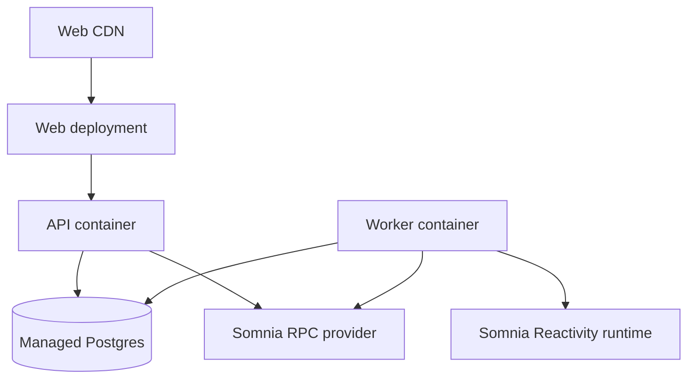

# 12. Deployment architecture

## Testnet topology

The first implementation targets Shannon testnet (`50312`). Mainnet is a separate environment with separate allowlists and secrets. Elwood (`50313`) is available for compatibility testing only.

## Release gates

- immutable release SHA shown by `/health`;
- pinned dependency lockfile;
- OpenAPI validation and generated-client check;
- unit/integration/E2E critical journey tests;
- secret scan and dependency audit;
- verified contract addresses and chain ID;
- rollback target documented.

## Configuration

Required runtime configuration includes `CHAIN_ID`, `RPC_URL`, verified DreamDEX addresses, database URL, LLM key, allowed origins, rate limits, and release identity. Startup fails closed when a required address or chain ID is missing/mismatched.

No production/mainnet deployment is implied by this architecture repository.
