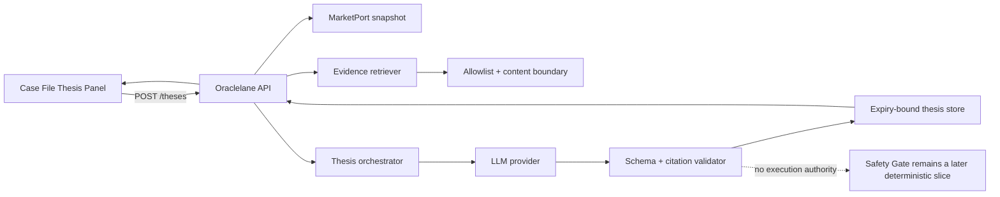
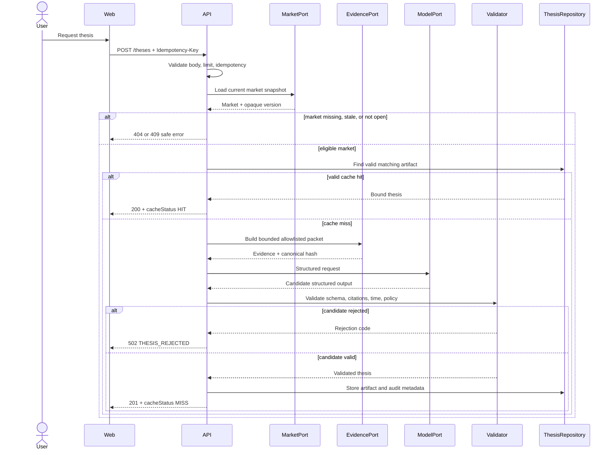

# 27. Thesis Panel architecture

## Purpose

Slice 2 adds an evidence-backed, expiry-bound advisory thesis inside the existing Market Case File route. It does not add a new route, a wallet requirement, a trade preview, or any transaction capability.

The user job is narrow: request a structured explanation for the currently viewed market, understand the evidence and uncertainty, and decide whether to continue later to the deterministic Safety Gate. `NO_TRADE` is a successful result, not an error.

## Scope

### In scope

- explicit user-triggered thesis request;
- server-validated market snapshot and evidence retrieval;
- `UP`, `DOWN`, and `NO_TRADE` direction;
- confidence band, summary, drivers, risks, citations, generation time, and expiry;
- valid, expired, unavailable, rejected, rate-limited, and market-conflict states;
- idempotent duplicate-request handling;
- contract-valid fixtures and consumer/provider tests.

### Out of scope

- arbitrary user prompts or prompt editing;
- client-submitted evidence or URLs;
- automatic thesis generation on page load;
- trade amounts, quotes, payout calculations, or safety decisions;
- wallet connection, signing, transaction submission, positions, or settlement;
- autonomous trading or an LLM with tools that can mutate state.

## Boundary and ownership



The web client owns request lifecycle and presentation only. The API owns input validation, rate limits, idempotency, current-market retrieval, evidence retrieval, orchestration, and safe errors. The Thesis orchestrator depends on `MarketPort`, `EvidencePort`, `ModelPort`, and `ThesisRepository`; provider SDK types do not cross those ports.

## Canonical request

`POST /api/v1/theses` is public for the hackathon MVP and rate-limited per IP. It requires an `Idempotency-Key` header and accepts only:

```json
{
  "marketId": "opaque-market-id",
  "chainId": 50312,
  "maxAgeSeconds": 300
}
```

Rules:

- `marketId` is opaque and must not be parsed by the client;
- `chainId` must be in the configured Somnia environment allowlist;
- `maxAgeSeconds` controls whether a still-valid stored thesis may be reused; it never extends `expiresAt`;
- the body has `additionalProperties: false`; prompt text, market facts, evidence, owner addresses, and model selection are rejected;
- the idempotency key is scoped to the normalized request and a bounded server window; reusing it with a different request returns `409`.

The server always reloads the market and evidence. The browser cannot choose the prompt, evidence packet, model, or output expiry.

## Canonical response

A successful `201` response for a new artifact or `200` response for a still-valid cache hit contains an artifact bound to the exact market snapshot and bounded evidence packet:

```json
{
  "data": {
    "thesisId": "ths_01",
    "marketId": "opaque-market-id",
    "chainId": 50312,
    "marketVersion": "opaque-snapshot-version",
    "direction": "NO_TRADE",
    "confidenceBand": "LOW",
    "summary": "Available evidence does not support a directional view.",
    "drivers": ["Market pricing remains balanced."],
    "risks": ["The evidence window is short."],
    "evidence": [
      {
        "sourceId": "src_market_snapshot",
        "title": "DreamDEX market snapshot",
        "url": "https://example.invalid/source",
        "publishedAt": null,
        "retrievedAt": "2026-08-30T09:00:00Z",
        "relevance": "MARKET_DATA"
      }
    ],
    "evidenceHash": "sha256:0000000000000000000000000000000000000000000000000000000000000000",
    "generatedAt": "2026-08-30T09:00:05Z",
    "expiresAt": "2026-08-30T09:05:05Z",
    "modelVersion": "provider-model-version",
    "promptVersion": "thesis-v1"
  },
  "meta": {
    "requestId": "req_01",
    "cacheStatus": "MISS"
  }
}
```

Invariants:

- `expiresAt` is strictly after `generatedAt` and bounded by server policy;
- `marketVersion` identifies the server-validated snapshot, not a browser timestamp;
- `evidenceHash` is computed from the canonical bounded packet;
- every returned citation references an evidence item in that packet;
- `drivers` and `risks` each contain one to three short items;
- summary, evidence, and lists render as text; raw model HTML is never accepted;
- `NO_TRADE` carries the same complete evidence and expiry structure as a directional thesis.

## Runtime flow



## Presentation state contract

The frontend derives one exhaustive state and fails closed for unknown values:

| State | Trigger | Allowed behavior |
|---|---|---|
| `not_requested` | no request made | show explicit request action |
| `loading` | one request in flight | preserve Case File facts; disable duplicate action |
| `valid_directional` | valid `UP` or `DOWN`, not expired | show full advisory artifact |
| `valid_no_trade` | valid `NO_TRADE`, not expired | show full artifact with no execution implication |
| `expired` | local clock is at or after `expiresAt` | keep artifact visible but mark unusable for later preview |
| `market_conflict` | API `409` | keep Case File usable; require market refresh |
| `rate_limited` | API `429` | respect `Retry-After`; no automatic loop |
| `rejected` | API `502` | do not show partial model output or citations |
| `unavailable` | API `503` or safe network failure | keep market facts usable; allow explicit bounded retry |

The client aborts an in-flight request when the market route changes and ignores late responses whose market identity does not match the current route. A new request replaces an old thesis only after a complete response validates at the generated OpenAPI boundary.

## Failure and error semantics

| HTTP | Stable code examples | Meaning | Retry policy |
|---|---|---|---|
| `404` | `MARKET_NOT_FOUND` | market identity is unknown on the requested chain | no blind retry |
| `409` | `MARKET_NOT_ELIGIBLE`, `IDEMPOTENCY_CONFLICT` | market snapshot is stale/closed or key was reused with another body | refresh market or create a new key |
| `422` | `VALIDATION_ERROR` | malformed or unsupported request | fix request; no retry |
| `429` | `THESIS_RATE_LIMITED` | quota exceeded | wait for `Retry-After` |
| `502` | `THESIS_REJECTED` | provider output, schema, uncertainty, or citations failed validation | no blind retry |
| `503` | `THESIS_UNAVAILABLE`, `EVIDENCE_UNAVAILABLE` | model or evidence provider is temporarily unavailable | one explicit user retry |

Error envelopes include a browser-safe message and optional `requestId`. Raw provider output, prompts, evidence content, stack traces, and secrets remain server-only.

## Security and abuse controls

- limit request body size to 2 KiB before JSON parsing;
- rate-limit per IP and normalized market identity; return `Retry-After`;
- never accept a user prompt, evidence URL, model name, expiry, or confidence value;
- retrieve only through allowlisted HTTPS sources with DNS/IP and redirect protections against SSRF;
- treat all retrieved content as untrusted data, never instructions;
- use structured model output with strict schema validation and `additionalProperties: false`;
- reject unknown or duplicated citation IDs and evidence not present in the packet;
- cap model input/output tokens, provider latency, evidence count, and text lengths;
- give the model no wallet, contract-write, database-mutation, or trade tools;
- log hashes, versions, result status, latency, and correlation IDs; do not log secrets or raw browser identifiers.

## Cache and persistence

The server cache identity is:

```text
chainId + marketId + marketVersion + evidenceHash + promptVersion + modelVersion
```

Only a validated and unexpired artifact may be returned as `HIT`. `maxAgeSeconds` can make a stored artifact too old even when its absolute expiry is later. Expired/rejected candidates are never served. The frontend may cache only through `expiresAt` and must include `chainId`, `marketId`, `marketVersion`, and `evidenceHash` in the stored artifact identity.

Persist enough audit metadata to reproduce the validation decision: thesis ID, market/evidence hashes, prompt/model/validator versions, timestamps, validation result, request ID, and safe provider status. Raw prompts and full evidence content are not required in browser-facing storage.

## Observability

Required metrics and trace fields:

- `thesis_requests_total{result,cache_status}`;
- `thesis_latency_ms{stage}` for market, evidence, model, and validation stages;
- `thesis_validation_failures_total{reason}`;
- `thesis_rate_limit_total`;
- `requestId`, `thesisId`, `chainId`, hashed market identity, release SHA, prompt version, model version, and evidence hash.

The eventual demo may expose sanitized generated/retrieved timestamps and evidence lineage. It must not expose provider credentials, raw prompts, hidden reasoning, or internal stack traces.

## Required fixtures

| Fixture | Required assertion |
|---|---|
| `thesis-valid-up` | known citations, future expiry, drivers and risks |
| `thesis-valid-no-trade` | `NO_TRADE` renders as a complete successful artifact |
| `thesis-expired` | full artifact remains visible but unusable for preview |
| `thesis-market-conflict` | `409` requires market refresh and preserves Case File facts |
| `thesis-rate-limited` | `429` exposes bounded recovery with `Retry-After` |
| `thesis-rejected` | `502`; no partial output or citations reach the UI |
| `thesis-unavailable` | `503`; market facts remain usable |

All success fixtures must validate against OpenAPI and include citation IDs present in the response evidence array. Provider contract tests must prove that unknown citation IDs, missing uncertainty, invalid expiry, oversized output, stale/closed markets, and extra schema fields are rejected.

## Slice 2 exit gate

Slice 2 is contract-ready when:

- ADR-0010 and the amended OpenAPI are accepted;
- generated types compile without handwritten thesis DTOs;
- provider and consumer fixtures cover every required state;
- the frontend renders an exhaustive state mapper and never displays unvalidated partial output;
- `NO_TRADE` is tested as success;
- expiry makes a thesis unusable for later preview without deleting evidence;
- idempotency and rate-limit behavior have integration tests;
- no code path gives the LLM transaction, wallet, or deterministic safety authority.
